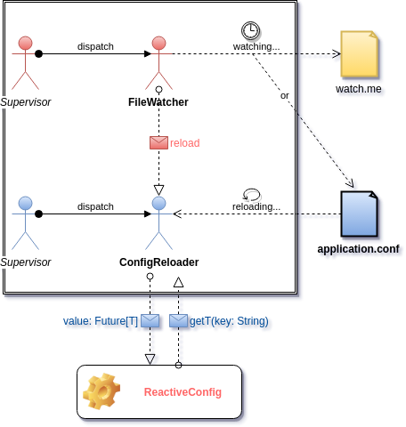

---?image=assets/scalaio-intro.png

---?image=assets/scalaio-sponsors.jpg

---
#### Typesafe Config

A type-safe configuration library for JVM languages.

Standard behavior load:
1. system properties
1. application.conf
1. application.json
1. application.properties
1. reference.conf

Note:
- Qui a déjà utilisé Typesafe Config ?
- Qui s'est déjà plaint de ne pas pouvoir recharger ses props après démarrage du server ?

* All resources on classpath with this name

+++

#### Pros
- supports files in three formats: Java properties, JSON, and a human-friendly JSON superset (called HOCON)
- merges multiple files across all formats
- can load from files, URLs, or classpath
- users can override the config with Java system properties, java -Dmyapp.foo.bar=10

Note:
- HOCON = Human-Optimized Config Object Notation
- Files use the suffix .conf
+++ 

#### Cons
- config not hot reloadable
- Java types (for Scala projects)
- maybe others...

---
#### Reactive Config
- A Reactive Wrapper over the Typesafe Config library that allows to get the latest refreshed configuration. 
- This library takes advantage of reactive solutions such as Akka actor. 

Note:
Si le fichier de configuration est modifié -> Une configuration fraîche est chargée sans avoir à redémarrer l'application.

---



---?code=src/main/scala/com/github/achelimed/reactiveconfig/actors/FileWatcher.scala
@[12](FileWatcher actor definition)
@[21](FileWatcher state)
@[23-35](FileWatcher behavior)

+++?code=src/main/scala/com/github/achelimed/reactiveconfig/actors/ConfigReloader.scala
@[9](ConfigReloader actor definition)
@[13](ConfigReloader state)
@[20-32](ConfigReloader behavior)

+++?code=src/main/scala/com/github/achelimed/reactiveconfig/ReactiveConfig.scala
@[20](Initial Config when starting (can not be changed))
@[22](Initial config)
@[36](The Reactive Config interface that wrap Typesafe Config)
@[43](Supplying an execution context)
@[46-49](Actor system)
@[52-53](Create 2 supervisors, one for each actor)
@[56-58](Schedules to send the "Check" message to the FileWatcher)
@[72](Get current config from the last reload)
@[172](getString method)

---
###### sbt dependencies

```
libraryDependencies += "com.github.achelimed" %% "reactive-config" % "1.0.0"
```

###### How to use it?
```
class Foo(reactiveConfig: ReactiveConfig)(implicit executionContext: ExecutionContext) {

    import com.github.achelimed.reactiveconfig.utils.implicits.FutureDefaultValues._
    
    val value: Future[String] = reactiveConfig.getString("key") orDefault "this_is_a_default_value"
    
    value foreach println
}
```
+++
###### Static values

If you are constrained to deal without Futures, You can get the values from the initial config loaded when the application first started

```
    val value: String = Try { reactiveConfig.Initial.getString("key") } getOrElse "default-value"
```

+++

###### With Playframework

```
@Singleton
class ReactiveConfigImpl @Inject() (implicit exec: ExecutionContext) extends ReactiveConfig {
  override implicit def executionContext: ExecutionContext = exec
}

@Singleton
class AsyncController @Inject()(cc: ControllerComponents,
                                actorSystem: ActorSystem,
                                reactiveConfig: ReactiveConfigImpl)
                               (implicit exec: ExecutionContext) extends AbstractController(cc) {

  def message = Action.async {
    for {
        url <- reactiveConfig.getString("app.cms.url")
        content <- call cms...
    } yield Ok(content)
  }
}
```
---
#### OPS

If you want to reload the config from another file, use system properties as follows (as allowed by the Typesafe Config library).

```bash
    -Dconfig.resource="another-file"
```
or
```bash
    -Dconfig.file="whatever/you/want/another-file.conf"
```

+++
#### OPS

application.conf:
```json
reactive-config {
    file-watcher {
        path = "whatever/you/want/watch.me"
    }
}
```
or
```bash
    -Dreactive-config.file-watcher.path="whatever/you/want/watch.me"
```
and you have to touch this file or apply the reactiveConfig.reload() method.

---

_Your question is a **`val (not null)`**... My response is a **`var (nullable)`**_ 

---?image=assets/scalaio-thanks.jpg


