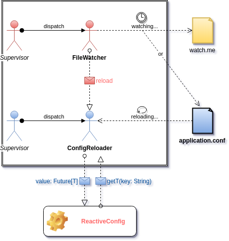

---?image=assets/scalaio-intro.png

---?image=assets/scalaio-sponsors.jpg

---
#### Typesafe Config

A type-safe configuration library for JVM languages.

Standard behavior load:
1. system properties
1. application.conf
1. application.json
1. application.properties
1. reference.conf

Note:
- Qui a déjà utilisé Typesafe Config ?
- Qui s'est déjà plaint de ne pas pouvoir recharger ses props après démarrage du server ?

* All resources on classpath with this name

+++

#### Pros
- supports files in three formats: Java properties, JSON, and a human-friendly JSON superset (called HOCON)
- merges multiple files across all formats
- can load from files, URLs, or classpath
- users can override the config with Java system properties, java -Dmyapp.foo.bar=10

Note:
- HOCON = Human-Optimized Config Object Notation
- Files use the suffix .conf
+++ 

#### Cons
- config not hot reloadable
- Java types (for Scala projects)
- maybe others

---
#### Reactive Config
- A Reactive Wrapper over the Typesafe Config library that allows to get the latest refreshed configuration. 
- This library takes advantage of reactive solutions such as Akka actor. 

Note:
Si le fichier de configuration est modifié -> Une configuration fraîche est chargée sans avoir à redémarrer l'application.

---



---?code=src/main/scala/com/github/achelimed/reactiveconfig/actors/FileWatcher.scala
@[12](actor definition)
@[21](state)
@[23-35](behavior)

+++?code=src/main/scala/com/github/achelimed/reactiveconfig/actors/ConfigReloader.scala
@[9](actor definition)
@[13](state)
@[20-32](behavior)

---
###### sbt dependencies

```sbt
libraryDependencies += "com.github.achelimed" %% "reactive-config" % "1.0.0"
```

###### How to use it?
```
class Foo(reactiveConfig: ReactiveConfig)(implicit executionContext: ExecutionContext) {

    import com.github.achelimed.reactiveconfig.utils.implicits.FutureDefaultValues._
    
    val value: Future[String] = reactiveConfig.getString("key") orDefault "this_is_a_default_value"
    
    value foreach println
}
```

---

_Your question is a **`val`**... My response is a **`var`** - Me. 2017_ 

---?image=assets/scalaio-thanks.jpg


