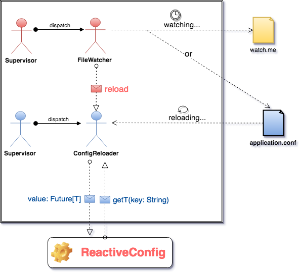

A Reactive Wrapper over the [Typesafe Config library](https://github.com/typesafehub/config) that allows to get the latest refreshed configuration. As soon as the configuration file under watch of this library changes, a fresh configuration is loaded for you
automatically without having to restart the application. This library takes advantage of reactive solutions such as Akka actor.

### Typesafe Config Workflow

### Reactive Config Architecture

### Binary Releases

sbt dependency:

        libraryDependencies += "com.github.achelimed" %% "reactive-config" % "{version}"
    
## Using the Library

### API Examples
Just mix with the ReactiveConfigurable trait that provides some utility functions to leverage this library at ease.
        
        import com.github.achelimed.reactiveconfig.ReactiveConfig
        import com.github.achelimed.reactiveconfig.utils.implicits.FutureDefaultValues._
        import scala.concurrent.ExecutionContext
        
        class Foo(reactiveConfig: ReactiveConfig)(implicit executionContext: ExecutionContext) {
            val value: Future[String] = reactiveConfig.getString("key") orDefault "this_is_a_default_value"
        
            value foreach println
        }

By default, this library watches the application.conf file and reloads the config from that only when changes made to the same.

If you want to reload the config from another file, use system properties as follows
(as allowed by the Typesafe Config library).
        
        -Dconfig.resource="another-file"
or

        -Dconfig.file="whatever/you/want/another-file.conf"
        
In this case, the reactive-config lib listens the changes in the provided file.

If you want to reload the configuration when a configuration file other than the principal configuration file (i.e. application.conf) changes (batch mode),
in that case you should override the `reactive-config.file-watcher.path` key in your principal config file or use a system property as shown below

application.conf:

        reactive-config {
            file-watcher {
                path = "whatever/you/want/watch.me"
            }
        }
        
or
    
        -Dreactive-config.file-watcher.path="whatever/you/want/watch.me"

and you have to `touch` this file or apply the `reactiveConfig.reload()` method.
        
    
### Static values
If you are constrained to deal without `Future`s, reactive-config allows you to get the values
from the initial config loaded when the application first started

        val value: String = Try { reactiveConfig.Initial.getString("key") } getOrElse "default-value"
